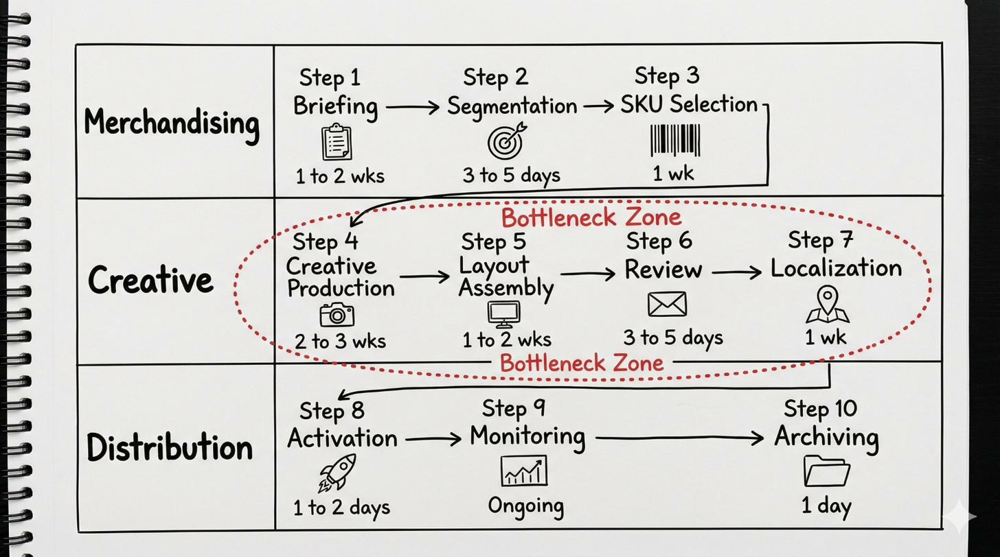

# Final Process Redesign: Macy's Marketing Campaign Workflow

## From M1 Current State to M4 AI-Supported State

M1 documented a 6 to 8 week promotional campaign cycle where "every single transfer is manual" across 10 sequential steps spanning three organizational lanes: Merchandising (Steps 1-3), Creative (Steps 4-7), and Distribution (Steps 8-10). The M1 swimlane diagram identified Steps 4 through 7 as the "Bottleneck Zone" — the consecutive stretch where manual coordination consumes the most calendar time relative to the creative or strategic judgment involved. This document explains what changed in the M4 AI-supported redesign, what stayed the same, and where the new boundaries between human authority, AI judgment, and deterministic automation sit.

The redesign does not eliminate any step or any role. It changes the dominant activity within each step: from manual data gathering and file production to structured review and strategic judgment. The 5-action Review screen (Approve, Edit, Reject, Rerun, Escalate), the Evidence side panel, and the persistent audit log are the runtime mechanisms that make this shift safe. Every AI output is inspectable, every human decision is logged, and every cascade dependency is traceable.

## Workflow Diagram

The diagram below is the original M1 swimlane sketch that mapped the 10-step campaign process across three organizational lanes. M1 already used the assignment's color system to distinguish step types, and the red dashed oval marks the Bottleneck Zone at Steps 4 through 7 where the heaviest manual coordination friction was concentrated.

The M4 redesign preserves this 10-step structure. The changes are not to the steps themselves but to what happens within each step: who does the work, what tools support them, and where human review gates enforce accountability. The Step Classification table below maps each step to its M4 color classification.

## Step Classification

The M4 color system classifies each step by who does the primary work and where human authority is required. Colors follow the assignment specification: Green for purely human work, Red for AI-generated output, Purple for human review gates, Orange for human-AI collaboration, and Blue for deterministic automation.

| Step | Activity | Classification | Color | Rationale |
|---|---|---|---|---|
| 1 | Briefing | Human + AI structuring | Orange | Campaign Manager writes the brief; the /start screen provides structured fields, validation, and "Load Example" presets but generates no AI content. The human drives; the tool structures. |
| 2 | Segmentation | Automation + Human review | Blue + Purple | The Audience Segment Builder runs k-means clustering (k=3) on 50,000 RFM-scored customers. This is deterministic computation, not LLM judgment. Marketing Analyst (Shankar) reviews 3 segments and can override the AI recommendation with a logged reason. |
| 3 | SKU Selection | Automation + Human review | Blue + Purple | The SKU Recommender scores 61 SKUs using a weighted formula (vendor commitment 30%, margin 25%, inventory 25%, seasonality 20%). MAP-protected SKUs are auto-excluded via the `check_pricing_conflicts` MCP tool. Campaign Manager (Merna) must "Lock In" the final set before the workflow advances. |
| 4 | Creative Production | Automation + Human review | Blue + Purple | The DAM Asset Finder ranks 5,000 assets by relevance using the `find_dam_assets` MCP tool. Senior Designer (Abdullah) reviews the top-12 shortlist, can override rankings, add custom assets, or reject and rerun with different parameters. |
| 5 | Layout Assembly | AI + Human review | Red + Purple | The Layout Copy Generator skill drafts tagline, body copy, CTA, and visual direction for 4 placements (web banner, email, mobile push, in-store signage). Character limits are enforced per placement. Senior Designer or Production Artist refines via the Edit action, which preserves the original AI version alongside human changes. |
| 6a | Compliance Pre Check | AI + Human approval | Red + Purple | The Compliance Pre Check skill scans campaign copy against 4 RAG documents (BRAND-GL-2026-001, LEGAL-DIS-2026-002, PRICE-RULES-2026-001, COMP-EX-2026-001) using HyQ retrieval and calls the `check_pricing_conflicts` MCP tool. Returns 3 findings (Brand Alignment, Disclaimers, Pricing Cross-Check) with pass/warn/fail status and cited sources. **Mandatory human approval** — the reviewer must select one of the 5 Review actions before the campaign can advance. |
| 6b | Approval Brief | AI + Human approval | Red + Purple | The Approval Brief Generator skill writes a VP-ready brief citing RETRO-Q4-2025 and RETRO-SP-2025-BTY for ROI benchmarks. It reads Step 6a compliance output as input. **Executive approval required** — the VP reviews risk flags, cross-checks against compliance evidence, and makes an explicit 5-action decision. |
| 6c | Revision Routing | AI + Human routing | Red + Purple | The Revision Router skill classifies VP revision comments into change type, owner, and urgency, referencing TICKET-INC-2025-4471 and TICKET-INC-2026-0212 for routing examples. The receiving owner can accept or re-route via Edit if the classification is wrong. |
| 7 | Localization | Automation + Human review | Blue + Purple | The Localization Generator creates up to 40 variants across 10 regions and 4 placements. The `generate_locale_variants` MCP tool handles transcreation to Spanish and Quebec French, referencing LOC-STYLE-2025-002. Production Artist (Anna) spot-checks 4 to 6 variants with source and target text displayed side-by-side. |
| 8 | Activation | Automation + Human confirmation | Blue + Purple | The Activation Scheduler computes timezone-aware send times and frequency caps. The media coordinator reviews for conflicts with other active campaigns and must explicitly confirm before the campaign goes live. This is the last gate before customer-facing launch. |
| 9 | Monitoring | Automation + Human interpretation | Blue + Green | The Campaign Performance Analyzer computes daily KPIs, last-touch attribution, and a linear regression forecast with an 80% confidence interval. Marketing Analyst (Shankar) interprets the numbers and recommends mid-campaign optimizations. The AI computes; the human decides what it means. |
| 10 | Reporting | AI + Human sign-off | Red + Purple | The report generator drafts an executive summary from the full audit trail across all 10 steps. Campaign Manager (Merna) finalizes with qualitative insights and lessons learned. She owns the final sign-off before the report reaches leadership. |

## What Changed from the Original Process

**The Bottleneck Zone is no longer a bottleneck.** M1's swimlane diagram circled Steps 4 through 7 as the zone where the most calendar time was consumed by coordination rather than creative work. Creative Production (Step 4) took 2 to 3 weeks because designers spent "significant time on data entry rather than creative work," hunting through the Xinet WebNative DAM for assets one at a time. Layout Assembly (Step 5) took 1 to 2 weeks because production started from blank pages. Review (Step 6) consumed 3 to 5 days with 2 to 4 revision rounds per campaign. Localization (Step 7) required manually producing 40 to 50 file variants per campaign. In the M4 redesign, these four steps compress from a combined 7 to 11 weeks down to 3 to 6 business days. The work that remains within each step is judgment work — reviewing AI-ranked assets, refining AI-drafted copy, inspecting compliance evidence, spot-checking localization variants — not file production or data gathering.

**Human review is heavier, not lighter, than the original process.** This is counterintuitive but intentional. In M1's workflow, review at Step 6 was a single approval gate where stakeholders often rubber-stamped under timeline pressure. M1 documented that "a single stakeholder's delayed response holds up the entire campaign," which pushed teams toward rushed reviews. The M4 redesign replaces this single gate with a 5-action Review screen (Approve, Edit, Reject, Rerun, Escalate) at Steps 6a, 6b, and 6c, plus review checkpoints at Steps 3, 5, 7, and 8. Each review action is logged with timestamp, persona identity, and reason. The Review screen is intentionally more friction than a one-click "looks good" to combat the rubber-stamping pattern that M1 documented and that Failure Case 7 predicts will persist if the gate is too easy to pass.

**Cascade transparency replaces version chaos.** M1 documented the symptom of opaque decision-making: "files named 'final,' 'final2,' 'final_v3' with no version control." In the M4 redesign, every AI output is paired with an evidence record showing the RAG documents retrieved, MCP tool calls with full input/output JSON, data sources consulted, prior step outputs referenced, and assumptions stated. The Evidence side panel makes this visible without navigating away from the current step. The "Prior Step Outputs Referenced" section makes cascade dependencies explicit — when Step 6b's brief reads Step 6a's compliance output, that lineage is visible and traceable. The audit log preserves every Review action with the evidence that was available at decision time, making post-campaign reconstruction trivial rather than archaeological.

**The new business output is documentation, not just a launched campaign.** M1's process produced a launched campaign and, weeks later, a manually reconstructed post-campaign report. The M4 process produces the same launched campaign plus a structured audit trail that accompanies it from Step 1 through Step 10. Every brief, segment selection, SKU decision, asset choice, copy draft, compliance finding, VP approval, locale variant, activation schedule, performance metric, and executive report is preserved with timestamps, persona identity, and evidence lineage. This audit trail is the Evidence screen's persistence layer and is the raw material for the Step 10 report generator. The shift from "launched campaign with fragmented trail" to "launched campaign with complete documentation" is as significant as the time savings.

## Which Steps Should Be Faster or Easier

The largest time reductions align with M1's documented worst-friction steps, as detailed in `estimates.md`:

- **Step 4 (Creative Production):** 5 to 10 business days down to 1 to 2 business days. The DAM Asset Finder reduces per-asset search time from 15-30 minutes (M1 documented) to seconds. Abdullah focuses on creative direction rather than metadata hunting.
- **Step 5 (Layout Assembly):** 5 to 7 business days down to 1 to 2 business days. The Layout Copy Generator drafts initial copy for 4 placements. The production artist refines rather than starting from a blank page.
- **Step 6 (Final Approval):** 3 to 7 business days (often 10+ with revision rounds) down to 2 to 4 hours. The Compliance Pre Check catches issues before the VP sees the brief, reducing revision rounds from 2-4 per campaign to typically 1. The Approval Brief Generator auto-drafts the VP brief.
- **Step 7 (Localization):** 5 to 8 business days down to 1 to 2 hours. The Localization Generator creates all 40 variants automatically. Anna spot-checks 4 to 6 instead of manually producing all 40 to 50.

Steps 1 (Briefing), 8 (Activation), and 9 (Monitoring) see moderate improvements — hours instead of days — because the AI structures and computes but the human still drives the strategic decisions. Step 10 (Reporting) drops from 1-2 weeks to 1-2 days because the audit trail eliminates manual reconstruction.

The overall cycle compresses from 6 to 8 weeks to 1 to 2 weeks (70-80% reduction). This estimate aligns with M1's own user story projections and sits within the 30-70% range reported in industry benchmarks for AI-supported marketing operations, as documented in `face_validity.md`.

## Which Steps Still Require Human Judgment

Three categories of human judgment persist in the M4 redesign, and no amount of AI capability should eliminate them.

**Strategic direction (Step 1).** The campaign brief is a human artifact. The /start screen structures input with required fields and character minimums, and "Load Example" presets demonstrate strong brief patterns, but the AI generates no content at this step. Campaign strategy — which audience to target, what message to lead with, how to position against competitors — requires business context, market intuition, and organizational priorities that no model can substitute. A vague brief produces generic downstream output across all 9 remaining steps (Failure Case 5), and the only remedy is a stronger brief from a human who understands the business objective.

**Authority gates (Steps 6a, 6b, 8, 10).** Compliance approval, executive sign-off, activation confirmation, and final reporting require named human authority because the consequences of error are irreversible and customer-facing. An AI that ships non-compliant copy to nearly 30 million Star Rewards members creates more damage in minutes than a slow manual process would in weeks. The M4 design requires explicit human approval at these gates not because the AI cannot make a recommendation — it does, via the confidence indicator and the `recommended_action` field — but because business accountability must attach to a person, not a model. The audit log records who approved, when, and what evidence they reviewed.

**Interpretation (Step 9).** The Campaign Performance Analyzer computes KPIs, attribution, and forecasts, but interpreting what the numbers mean for the next campaign requires marketing judgment. Last-touch attribution may disagree with platform-native attribution models (M1 documented this as a persistent pain point). The analyst must reconcile competing signals, weigh qualitative factors the model cannot see, and recommend optimizations that account for brand strategy, competitive dynamics, and seasonal context. The AI provides the analytical foundation; the human provides the meaning.

## Which Steps Are Risky if Fully Automated

Three areas carry the highest risk if the human review gates were removed, each grounded in specific failure cases from `failure_cases.md`:

**Compliance findings (Step 6a).** Failure Case 2 documents that Claude can hallucinate a compliance finding — inventing a MAP violation that does not exist in PRICE-RULES-2026-001 (false positive) or missing a real violation documented in COMP-EX-2026-001 (false negative). The deterministic helpers (banned word scan, tagline list check, pricing language parser) catch some cases, but the LLM writes the human-readable "reason" string and can fabricate authoritative-sounding reasoning. A false negative is the dangerous case: a non-compliant pricing claim ships to customers, exposing Macy's to FTC representative pricing enforcement. The Evidence pill makes hallucinations detectable by showing the cited passage alongside the AI's stated reasoning, but only if a human actually inspects it.

**Revision routing (Step 6c).** Failure Cases 1 and 5 intersect here: a vague VP revision comment like "make it better" or a stale RAG document (TICKET-INC-2025-4471) can produce a misrouted revision that sends a pricing issue to the design team instead of merchandising. Misrouting wastes time and compresses the downstream schedule. The risk is moderate per incident but compounds across multiple revision rounds.

**Activation timing (Step 8).** The Activation Scheduler computes send times and frequency caps algorithmically, but it cannot detect conflicts with campaigns managed by other teams outside the system, last-minute executive decisions to delay a launch, or external events (news cycles, competitor moves) that change the optimal timing. Step 8 is the last gate before customer-facing launch, and an automated send that goes out at the wrong time or overlaps with a conflicting promotion is visible to millions of customers and difficult to recall. The M4 design requires explicit human confirmation — the campaign does not auto-advance past Step 8.

## What the AI Coworker Needs

The AI coworker draws on three categories of inputs documented in `evidence_and_sources.md`:

**Data.** Three structured sources feed the workflow:

| Source | Scale (M3 Prototype) | Scale (M1 Production Spec) |
|---|---|---|
| Customer database (`macys.db`) | 50,000 synthetic customers with RFM features | Star Rewards loyalty database, nearly 30 million members |
| Product catalog (`product_catalog.json`) | 61 SKUs across 27 brands | Pricing Engine API with real-time inventory and MAP data |
| DAM assets (`macys.db` dam_assets table) | 5,000 records with tags, rights, and metadata | Xinet WebNative DAM, 100,000+ production images |

**Tools.** Three MCP tools registered via FastMCP connect AI skills to external data:

| Tool | Function | Used At |
|---|---|---|
| `check_pricing_conflicts` | MAP validation against a hardcoded brand list (Levi's, Coach, Lancome, Estee Lauder, Clinique, La Mer, Dior Beauty, Tag Heuer) | Steps 3, 6a |
| `find_dam_assets` | DAM lookup with rights filtering and relevance scoring | Step 4 |
| `generate_locale_variants` | Phrase substitution with regional pricing and language mappings | Step 7 |

**Documents.** Twelve RAG documents in a HyQ FAISS index (381 entries, 8/8 correct retrievals on benchmark vs. 5/8 for naive):

| # | Doc ID | Title | Used At |
|---|---|---|---|
| 1 | BRAND-GL-2026-001 | Brand Guidelines | Step 6a |
| 2 | APPROVAL-POLICY-2026-001 | Approval Policy | Step 6b |
| 3 | LEGAL-DIS-2026-002 | Legal Disclaimer Requirements | Step 6a |
| 4 | PRICE-RULES-2026-001 | Pricing and Promotion Rules | Step 6a |
| 5 | DAM-POLICY-2026-001 | DAM Tagging Policy | Step 4 |
| 6 | LOC-STYLE-2025-002 | Localization Style Guide | Step 7 |
| 7 | RETRO-Q4-2025 | Q4 2025 Holiday Campaign Retrospective | Step 6b |
| 8 | RETRO-SP-2025-BTY | Spring 2025 Beauty Campaign Retrospective | Step 6b |
| 9 | TICKET-INC-2025-4471 | Past Approval Ticket (revision routing example) | Step 6c |
| 10 | TICKET-INC-2026-0212 | Clean Approval Cycle Reference | Step 6c |
| 11 | COMP-EX-2026-001 | Compliance Flag Examples | Step 6a |
| 12 | TEAM-FAQ-2026-001 | Internal Team FAQ | Cross-cutting |

## The Final Business Output

The M4 AI-supported workflow produces a launched promotional campaign accompanied by a structured documentation package: the original brief with all structured fields, the selected audience segment with override rationale if applicable, the locked-in SKU set with MAP exclusion records, the ranked asset shortlist with designer selections, the AI-drafted and human-refined copy across 4 placements, the compliance findings with cited RAG passages and MCP tool outputs, the VP approval brief with risk flags and recommendation, the revision routing history with owner assignments and urgency classifications, the localization variant set with spot-check records, the activation schedule with confirmation timestamps, the live performance metrics with attribution and forecast, and the executive report with qualitative learnings. Every decision across all 10 steps is preserved in the audit log with timestamps, persona identity, and the evidence that was available at decision time. This audit trail is not a byproduct — it is a core deliverable that transforms campaign operations from "we think this is what happened" to "here is exactly what happened, who decided, and what they saw when they decided."

## Diagram Reference

The workflow diagram included above (`milestone04/ai_process_design.png`) is the original M1 swimlane sketch showing the 10-step campaign process across three organizational lanes (Merchandising, Creative, Distribution) with the Bottleneck Zone at Steps 4-7 marked in red. The M1 presentation already used a color system to distinguish step categories. The M4 Step Classification table in this document maps each step to its updated color classification reflecting the AI-supported process design.
